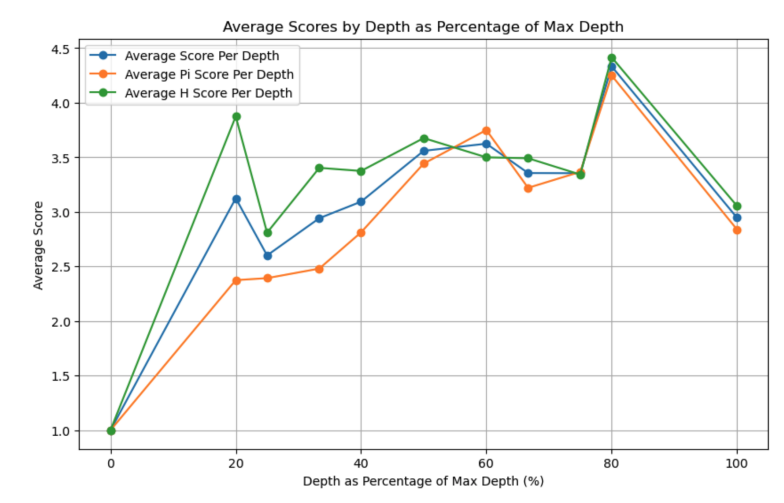

# Mathematical Expression Simplifier
An automated simplifier of mathematical expressions, stylistically guided by LLMs. Project for Purdue's CS 560 course (Reasoning about Programs), by Eylon Caplan, Arvind Ramaswami, and Shifa Somji. See the [report](CS_560_Project.pdf) for details.

---

## 📖 Overview

Given a set of example conversions of mathematical expressions, our goal is to force a large language model to transform a new expression into the same target style—while **guaranteeing mathematical equivalence** at every step via symbolic checking.

We frame the problem as a breadth‑first search over stylistic rewrites, scoring each candidate by two metrics (Pi and H) and tracking the average score.

---

## 🔧 Reproducing Results

To reproduce our experiments and generate all transformation trees, run:

```bash
python run_evals.py
```

---

## ✨ Example Conversions

Below are four induction examples (input ⟶ target):

- **Example A**  
  **Input:** `((x + 1)^2) + ((x - 2)^3) + y`  
  **Output:** `x^2 + 2x + 1 + x^3 - 6x^2 + 12x - 8 + y`

- **Example B**  
  **Input:** `((a + b)^3) + ((a - b)^2) + c`  
  **Output:** `a^3 + 3a^2b + 3ab^2 + b^3 + a^2 - 2ab + b^2 + c`

- **Example C**  
  **Input:** `((x + 2)^3) + ((x - 3)^2) + z`  
  **Output:** `x^3 + 6x^2 + 12x + 8 + x^2 - 6x + 9 + z`

- **Example D**  
  **Input:** `((a - 1)^3) + ((b + 2)^2) + z`  
  **Output:** `a^3 - 3a^2 + 3a - 1 + b^2 + 4b + 4 + z`

**Challenge**: Transform the held‑out expression into the same form:

```text
((x + 3)^2) + ((y - 4)^3) + z
```

⬇️

```text
x^2 + 6x + 9 + y^3 - 12y^2 + 48y - 64 + z
```

---

## 🔍 Method

1. **Example Induction**: Provide the LLM with N−1 input ⟶ output pairs.  
2. **BFS over Style Rewrites**: At each node, propose a single-step stylistic rewrite via the LLM and verify equivalence with a CAS.  
3. **Scoring**: Each candidate receives a Pi score and an H score; we track the average.  
4. **Selection**: Continue expanding until a candidate matches the target style exactly, or until a depth limit is reached.

---

## 📊 Visualizations

### 1. BFS Transformation Tree


*Nodes are expressions (with avg score), edges are single‑step rewrites.*

### 2. Heuristic Score Progression



*Average heuristic score increases with tree depth, illustrating stylistic refinement.*

---

Feel free to explore the [report](CS_560_Project.pdf) for full details on implementation and evaluation!

